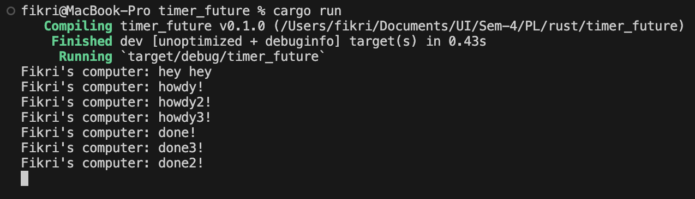

# Tutorial 10
Fikri Risyad Indratno 
2206031170 
Advanced Programming B 

---

## Reflection

The async function runs outside of the main function and the program won't for the async function to finish to continue its execution, causing `hey hey` to be printed before `howdy!` and `done!` even though `println!("hey hey")` was placed after `spawner.spawn`.

From the image above, we can see that `done3!` was printed before `done2!`. This happened because the program runs concurrently, so the order of execution can be different and is up to the `executor`.

If we remove `drop(spawner)`, the program will not finish because the `executor` doesn't know that there are no more tasks, so it will wait for new tasks even though there are no more tasks, causing the program to never die.